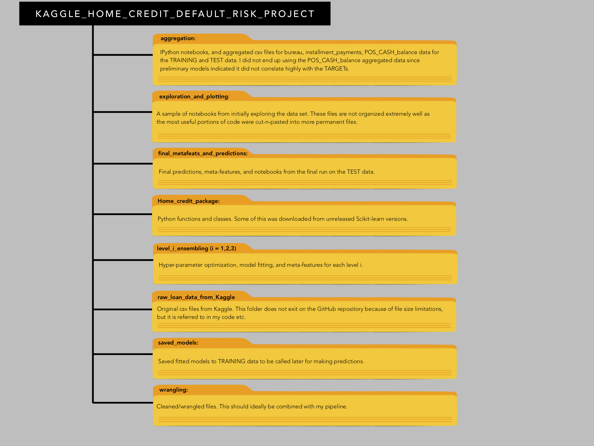
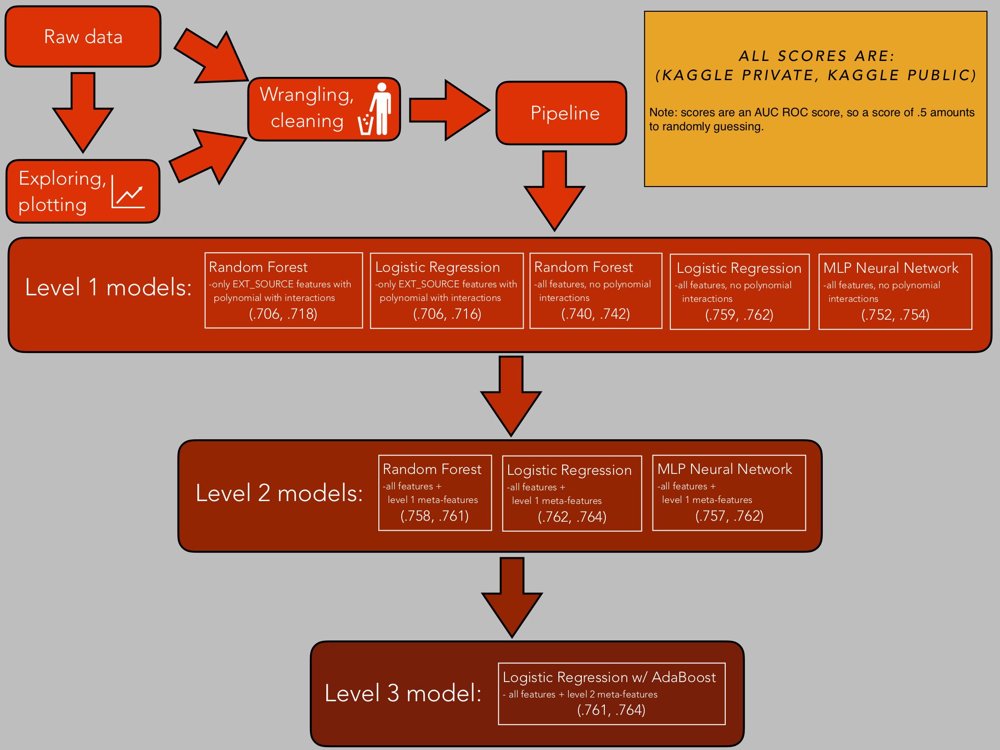
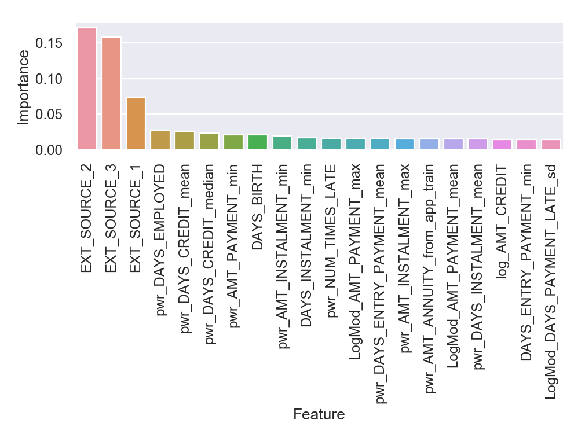
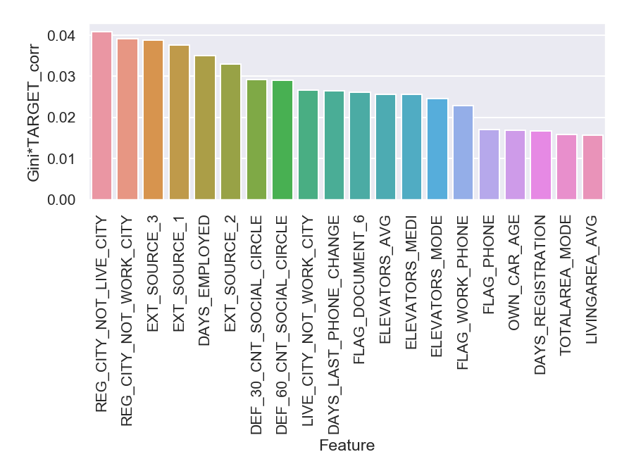

## My Kaggle score:
My best score was good enough for 4737 place out of 7198 submissions. In the end I was a bit disappointed with the placement of my final score, but my best score .76360 was not that far from the winning score of .80570. (Note: this is AUC ROC score, so a score of .5 amounts to randomly guessing.) It is important to keep a couple of things in mind with Kaggle competitions: 

- High performance kernels posted by other people in the community are freely available in the competition itself. I could have easily beaten my own score by downloading another person's kernel. I did not bother with this because I would not have learned anything, which was my primary goal (although winning either way would have be nice). I suspect these freely available kernels lead to a great deal of clustering near the top scores of these competitions since people can access kernels that take care a lot of the baseline work. The work in this project is 100 percent my own and I only very briefly checked some public kernels near the end of my project in order to see what I could learn from other people's work.
- I suspect many people either have access to higher performance machines either personally, through a school, or they invest in computational time on cloud services (I saw one in-code comment in a Kaggle kernel to this effect). That is totally legal, but I personally do not have unlimited access to such services. I spent the equivalent of ~$200 on Google Cloud (from their free introductory service). 
- Many top ranking submissions are composed of multiple people (sometimes 5+). I worked alone on this project. 

## My model:

- The "base" data file application_train.csv has 120 features in it. This means that after aggregation on the remaining data files and feature engineering, one could have hundreds or even thousands of features (I saw one kernel that had 10000+ features), which would make hyperparameter optimization and fitting the model extremely time consuming. I spent a good deal of time whittling down the features to keep the fitting manageable. For the application_train.csv I calculated the correlation of the features and the Gini coefficient of the features (I dimensionless measure of variation), multiplying these numbers together gave me a rough idea of the most important features prior to model building, and I only kept the top 48 features (see figure below). For the features produced from aggregation, I plotted the features and selected the best features by hand that had large correlation and variation, which added another 37 features. I checked the feature importances with my level 1 Random Forest which validated my work in that many of my engineered features were in the top 20 in feature importances.

- Numerical features were split into 'continuous numerical' that merits a polynomial fit (I used 4th degree polynomials to allow some nuance beyond a linear relationship), and then 'categorical numerical' that was then treated along with the rest of the categorical variables. For all categorical features, any category in a categorical variable that was present in less than 1 percent of the training data was put together into a catch-all bin for that categorical (this was done to prevent proliferation of features in instances were a categorical feature had very large numbers of categories with very small representation in the data). All categorical variables were then one-hot-key encoded.

- I built a 3 level ensemble model, with 5 models in level 1 and 3 models in level 2. This took a lot of time to code so that the data passed correctly  from one level to another. It turns out ensembling did not really gain me that much (Logistic Regression at level 1 is practically already near my final level 3 scores). Although ensembling likely would have helped me more if I included more models at level 1. In fact, my level 2 private Logistic Regression is slightly below my private level 3 Logistic Regression. That said, the ensemble was more of a proof of concept for my portfolio. See figure below.

## Specific features of my model worth mentioning:

- Early indications were that the EXT_SOURCE_1 feature had a high amount of correlation with the TARGET, but unfortunately was missing many values. Rather that simply impute missing values with the median I imputed based a linear fit to DAYS_BIRTH for each gender. 

- The aggregation features I created were very reasonable. Many of these ranked in the top 20 in feature importances in the level 2 random forest (anything that ends with a _min, _mean, _median, _max, _sd was an aggregated feature I created). See figure below.

- I was extremely careful not to overfit the model to my training data. Although I ended up training on the full data set, in the beginning stages I was always careful to reserve a validation set and check my results. A number of times a very high training score and low validation score alerted me to errors in my code. 

## Most important is what I learned from this project:

### Improvements to speed up my code, make it more efficient, and save time:

- The aggregation step in the analysis could definitely be sped up by implementing the Dask package (Pandas does not have parallelization). Scikit-learn has parallel options I used. 

- My final 3-level ensemble model was not very conducive to adding more first level models easily. Gathering from what other people do in these types of competitions is they create many first level models (I have seen 10 to 20 first level models) and then ensemble these into a single result in 1 or 2 more levels, which includes different pipelines for different models. I spent a ton of time trying a lot of different things on a single “perfect” pipeline. My time would have been better spent creating a multiple pipelines that feed into multiple models, and building a framework that accepted these new results at the first level in order to rapidly produce new final predictions. 

- I spent a lot of time optimizing hyperparameters. I was initially concerned that I might be missing some small gains if I did not explore the hyperparameter space thoroughly. I think 2 iterations of scanning over reasonable hyperparameter values would have been much more time efficient. For example, one scan over reasonable orders and magnitude, followed by a second scan over a given order of magnitude from the prior scan. For a model like the one I built, this would mean reducing a multi-hour process down to an hour or two. 

- I one-hot-key encoded all my categorical features, which led to a large number of features. I could implement ordinal encoding for decision tree models because a Decision Tree would not average values (ordinal encoding will not work for other models though like logistic regression). This would enable me to make some faster models in the initial stages to benchmark some results.

- I never really figured out the optimal number of trees for my random forests. More is always better in this case, but it would have been best to figure out an optimal number in terms of balancing results verse time early on in my model building.

- With such large data sets on my laptop, I had to be careful what I was loading into memory at a given time, and clear any used dataframes in memory at the time, otherwise my system grinded to a halt. I now have a much better sense of how to stay within the limitations of a machine using Python, Jupiter, Pandas, and Scikit-learn. 

### Improvements that could increase my score:

- I dropped whole csv files worth of features, many features from the csv files I did use, and features from my aggregation. This was due to the fact that low correlation with the TARGETs, small variance, and low feature important scores of initial random forest models indicated that many of these features had low predictive power. Simply keeping these features would have likely given me a small boost.

- I could use automated feature engineering like Featuretools. I was concerned that using this would lead to an even larger number of features, but I could have simply had this as a separate pipeline that feeds into a unique level 1 model for ensembling.

- I sparingly used polynomial interactions, but there was a lot of room to include other interaction features. 

- If I did add more features in, I would have likely had to implement PCA, dimensional reduction, recursive feature elimination, and/or perhaps randomly keep some features of lower importance in different level 1 models. 

- There are 3 methods I see a lot of people use in these competitions: CatBoost, LightGBM and XGBoost. I restricted myself to methods in Scikit-learn for this project for the sake of simplicity, which does not implement these methods. These other methods would have likely helped given their large prevalence in the Kaggle community.

### Organizational improvements:

- I need to implement a more uniform filing system. Training, validation, and test data were labeled a variety of different ways throughout the project. 

- Some code were broken up into smaller steps than necessary since I was working from the ground up for the first time, and I was not sure how much to package code if I did not know how repetitive it would be in the long run. Notably, I essentially constructed my pipeline in 2 steps, this was messy and dangerous. Also, I did my ensembling by hand essentially, and had to feed each level into the successive level by running separate notebooks. Overall both the pipeline, ensembling, and predictions, should have been combined such that predictions could be calculated in a single key stroke, not running multiple lines of code in multiple notebooks. 

In conclusion, I learned a lot on this project, and I think I will learn more by progressing onto other projects rather than taking a large amount of time to eek out small gains on this model (not to mention the competition is completed). Kaggle is a great place to get into data science but there are some limitations to this framework. First of all, in some cases, much of the cleaning is done for you, and I suspect real world problems would not have such a nice starting point. Secondly, Kaggle problems are already formulated, and so you are not developing the skills necessary to formulate your own problems and projects. As a result, I am trying to think of projects that are more my own (hence the weather prediction project also posted in my portfolio). I could see returning to a Kaggle competition in time in order to see how I have grown as a data scientist.

Fig 1: A directory map of the project.

Fig 2: Breakdown for the workflow and ensemble levels in the project.

Fig 3: Top 20 features ranked by importances for the level 1 Random Forest (all features, no polynomial interactions). This is not the final model in the ensemble, but it gives a good idea what is important. Many of my aggregated features appear. 

Fig 4: Gini index of a feature times the correlation of that feature with the TARGET. This gives a rough idea of both the spread in a feature and its potential for predicting the TARGET value.

